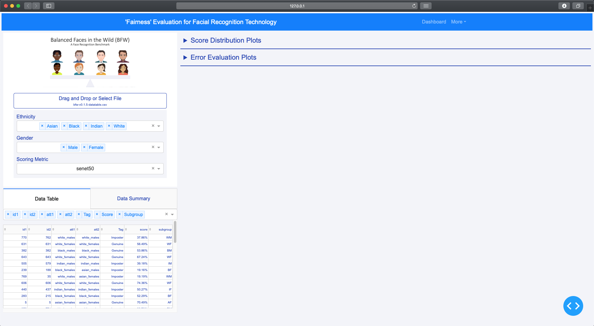
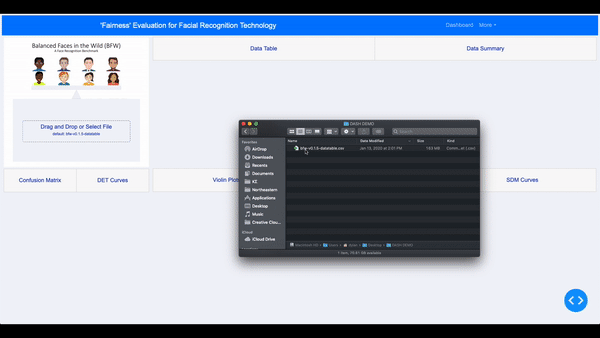

BFW Dashboard To Measure Bias
===============================

Description of Tool
--------
The Balanced Faces in the Wild Dashboard is a tool for users to find bias in their facial recognition models.

Table of Contents
--------------------
- [Code/Installation](#code/installation)
- [Research, Innovation, and Scholarship Expo](#RISE)
- [Key Terms](#keyterms)
- [Visualizations](#visualizations)
- [User Interface](#userinterface)
- [Skeleton](#skeleton)    

Code/Installation
------------
For installation and .py files visit this Github repo:

https://github.com/ddasgupta4/bfw-dash

For a closer look at the code and motivations visit this Github repo:
https://github.com/visionjo/facerec-bias-bfw

Research, Innovation, and Scholarship Expo
-------
- The research paper: https://github.com/aliceloukianova/bias-dash/blob/master/A%20Fairness%20Tool%20for%20Bias%20in%20FR.pdf
- The poster: https://github.com/aliceloukianova/bias-dash/blob/master/EECE2300-BIAS-RISE-2020-POSTER.pdf
- The presentation: https://prezi.com/js6eygtyapjl/rise-2020-bias-in-fr-technology
- The recording of the presentation: https://github.com/aliceloukianova/bias-dash/blob/master/Video%20Presentation.md

Key Terms
-------
True Positive/Sensitivity: Measures the proportion of actual positives that are correctly identified as such.

True Negative/Specificity: Measures the proportion of actual negatives that are correctly identified as such.

False Positive: When the prediction is positive and it’s false, this is a Type 1 Error. 

False Negative: When the prediction is negative and it’s false, this is a Type 2 Error.

SDM Curve: A violin plot showing a distribution of scores, using imposter and genuine scores against each other displaying the overlap between the two.

DET Curve: Detection error trade off curve plots the false negative rate (FNR) as a function of the false positive rate (FPR). A tool to see the tradeoff between the sensitivity and specificity of the FR model.

ROC Curve: Receiever operating characteristic curve plots the true positive rate (TPR) against the false positive rate (FPR). 

Confusion Matrix: Measures recall, precision, specificity, and accuracy in a model.

Recall: Measures how much was correctly predicted out of all the positive cases.

Precision: Looks at how many cases are truly positive out of the positive ones predicted correctly.

Specificity: Measures correctness of the true negative rate.

Accuracy: Measures much was predicted correctly out of all the classes.

Visualizations
------------
All vizualizations featured in the Dashboard can be found here: https://github.com/aliceloukianova/bias-dash/tree/master/Visualizations

This includes a Signal Detection Model , Detection Error Tradeoff (DET) Curves, Receiver Operating Characteristic (ROC) Curves, and a Confusion Matrix. 

User Interface
------------

Skeleton
------------

    ├── LICENSE
    ├── Makefile           <- Makefile with commands like `make data` or `make train`
    ├── README.md          <- The top-level README for developers using this project.
    ├── data
    │   ├── external       <- Data from third party sources.
    │   ├── interim        <- Intermediate data that has been transformed.
    │   ├── processed      <- The final, canonical data sets for modeling.
    │   └── raw            <- The original, immutable data dump.
    │
    ├── docs               <- A default Sphinx project; see sphinx-doc.org for details
    │
    ├── models             <- Trained and serialized models, model predictions, or model summaries
    │
    ├── notebooks          <- Jupyter notebooks. Naming convention is a number (for ordering),
    │                         the creator's initials, and a short `-` delimited description, e.g.
    │                         `1.0-jqp-initial-data-exploration`.
    │
    ├── references         <- Data dictionaries, manuals, and all other explanatory materials.
    │
    ├── reports            <- Generated analysis as HTML, PDF, LaTeX, etc.
    │   └── figures        <- Generated graphics and figures to be used in reporting
    │
    ├── requirements.txt   <- The requirements file for reproducing the analysis environment, e.g.
    │                         generated with `pip freeze > requirements.txt`
    │
    ├── setup.py           <- makes project pip installable (pip install -e .) so src can be imported
    ├── src                <- Source code for use in this project.
    │   ├── __init__.py    <- Makes src a Python module
    │   │
    │   ├── data           <- Scripts to download or generate data
    │   │   └── make_dataset.py
    │   │
    │   ├── features       <- Scripts to turn raw data into features for modeling
    │   │   └── build_features.py
    │   │
    │   ├── models         <- Scripts to train models and then use trained models to make
    │   │   │                 predictions
    │   │   ├── predict_model.py
    │   │   └── train_model.py
    │   │
    │   ├── visualization  <- Scripts to create exploratory and results oriented visualizations
    │   |   └── visualize.py
    │   │
    │   └── evaluation  <- Scripts to evaluate data metrics
    │       └── metrics.py
    │
    └── tox.ini            <- tox file with settings for running tox; see tox.testrun.org

--------

<small>Project based on the <a target="_blank" href="https://drivendata.github.io/cookiecutter-data-science/">cookiecutter data science project template</a>. #cookiecutterdatascience</small>

